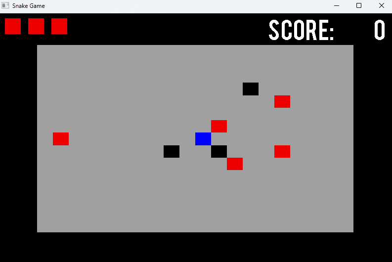

# Simple Snake Game with C and SDL Library
[2017-05-14] A Simple Snake Game with C and SDL Library

### 프로그램 개발 환경
- Language : C
- OS : Microsoft Windows 10
- IDE : Microsoft Visual Studio 2017 15.0

### 기능 설명
- C와 SDL 라이브러리를 사용하여 간단하게 제작한 스네이크 게임
- `[C]`버튼을 클릭하면 **그래픽 모드**로 플레이 할 수 있다.

### 프로그램 실행 방법
- Visual Studio에 **[SDL 라이브러리](https://github.com/libsdl-org/SDL/releases)** 연동

### 실행 화면

